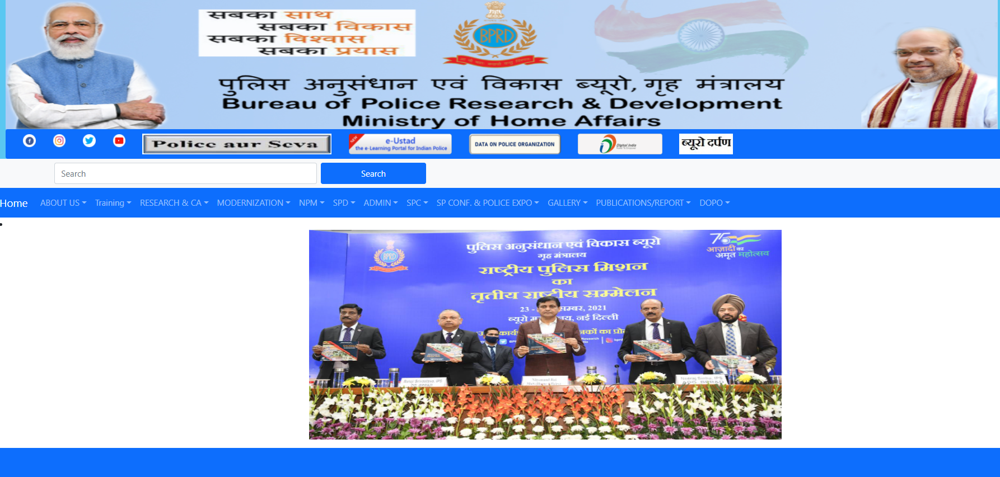
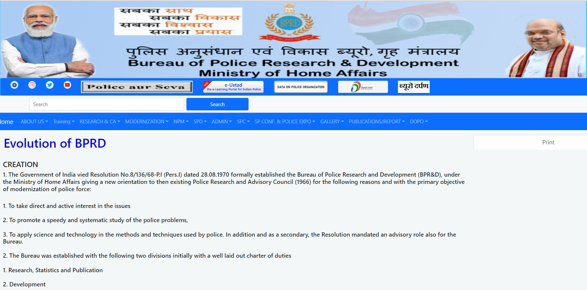
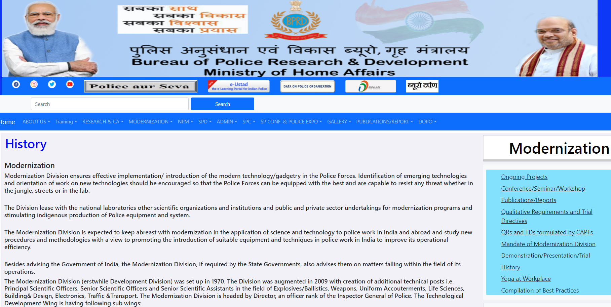

# Web Design using Bootstrap Framework

## AIM:
To design a website using bootstrap framework.

## DESIGN STEPS:

### Step 1:

Requirement collection.

### Step 2:

Creating the layout using bootstrap grid system.

### Step 3:

Updating the sample content.

### Step 4:

Choose the appropriate style and color scheme.

### Step 5:

Validate the layout in various browsers.

### Step 6:

Validate the HTML code.

### Step 6:

Publish the website in the given URL.

## PROGRAM :
### Home Page:
~~~
<!DOCTYPE html>
<html lang="en">
<head>
    <meta charset="UTF-8">
    <meta http-equiv="X-UA-Compatible" content="IE=edge">
    <meta name="viewport" content="width=device-width, initial-scale=1.0">
    <title>Bootstrap Website</title>
    <link href="https://cdn.jsdelivr.net/npm/bootstrap@5.0.2/dist/css/bootstrap.min.css" rel="stylesheet" integrity="sha384-EVSTQN3/azprG1Anm3QDgpJLIm9Nao0Yz1ztcQTwFspd3yD65VohhpuuCOmLASjC" crossorigin="anonymous">

</head>
<body>
    

       
        
          

          <nav class="navbar navbar-expand-lg navbar-dark bg-primary rounded">

                <ul class="navbar-nav ml-lg-auto">
                  <li class="nav-item">
                      <ul>
                         
                    </ul>
                  </li>
                  <li>
                      <ul>
                    
                </ul>
                  </li>
                  <li>
                      <ul>
                      
                    </ul>
                  </li>
                  <li>
                    <ul>
                      
                    </ul>
                  </li>
                  <li>
                    <ul>
                      
                    </ul>
                  </li>
                  <li>
                    <ul>
                      
                    </ul>
                  </li>
                  <li>
                    <ul>
                       
                    </ul>
                  </li>
                  <li>
                    <ul>
                       
                    </ul>
                  </li>
                  <li>
                    <ul>
                       
                    </ul>
                  </li>
                    

                  </li>
                </ul>
              

            

          </nav>
        

        <nav class="navbar navbar-expand-sm bg-light navbar-light">
           

                <button class="btn"><i class="fa fa-twitter" style="font-size:36px"></i></button>
                <button class="btn"><i class="fa fa-youtube-play" style="font-size:36px"></i></button>
                <button class="btn"><i class="fa fa-instagram" style="font-size:36px"></i></button>
                <button class="btn"><i class="fa fa-envelope" style="font-size:36px"></i></button>
            <form class=" d-flex">
                    <input class="form-control me-2" type="text" placeholder="Search" style="width: 500px; height: 40px">
                    <button class="btn btn-primary " type="button" style="width: 200px; height: 40px">Search</button>
                  </form>
            

          </nav>

          <nav class="navbar navbar-expand-sm bg-primary navbar-dark">
            
              <a class="navbar-brand" href="#">Home</a>
              <button class="navbar-toggler" type="button" data-bs-toggle="collapse" data-bs-target="#collapsibleNavbar">
                
              </button>
              

                <ul class="navbar-nav">
                  <li class="nav-item dropdown">
                    <a class="nav-link dropdown-toggle" href="#" role="button" data-bs-toggle="dropdown">ABOUT US</a>
                    <ul class="dropdown-menu">
                      <li><a class="dropdown-item" href="./About.html">Evolution Of BPRD</a></li>
                      <li><a class="dropdown-item" href="#">Awards/Medals</a></li>
                      <li><a class="dropdown-item" href="#">Work Allocation</a></li>
                      <li><a class="dropdown-item" href="#">Organization</a></li>
                      <li><a class="dropdown-item" href="#">Draft Legistation</a></li>
                      <li><a class="dropdown-item" href="#">Contact Us</a></li>
                      <li><a class="dropdown-item" href="#">Citizens Corner</a></li>
                    </ul>
                  </li>

                  <li class="nav-item dropdown">
                    <a class="nav-link dropdown-toggle" href="#" role="button" data-bs-toggle="dropdown">Training</a>
                    <ul class="dropdown-menu">
                      <li><a class="dropdown-item" href="#">Domestic Courses</a></li>
                      <li><a class="dropdown-item" href="#">Foreign Courses</a></li>
                      <li><a class="dropdown-item" href="#">Training Calender</a></li>
                      <li><a class="dropdown-item" href="#">Miscellaneous</a></li>
                      <li><a class="dropdown-item" href="#">Training Policy</a></li>
                      <li><a class="dropdown-item" href="#">Training Material</a></li>
                      <li><a class="dropdown-item" href="#">Training Division</a></li>
                      <li><a class="dropdown-item" href="#">Training Symposium</a></li>
                      <li><a class="dropdown-item" href="#">CAPT,Bhopal</a></li>
                      <li><a class="dropdown-item" href="#">CDTI</a></li>
                      <li><a class="dropdown-item" href="#">Union Home Minister Trophy</a></li>
                      <li><a class="dropdown-item" href="#">Union Home Minister Training Medal</a></li>
                      <li><a class="dropdown-item" href="#">Publications</a></li>
                      <li><a class="dropdown-item" href="#">Women Safety</a></li>
                      <li><a class="dropdown-item" href="#">Online Courses</a></li>
                    </ul>
                  </li>

                  <li class="nav-item dropdown">
                    <a class="nav-link dropdown-toggle" href="#" role="button" data-bs-toggle="dropdown">RESEARCH & CA</a>
                    <ul class="dropdown-menu">
                      <li><a class="dropdown-item" href="#">Research</a></li>
                      <li><a class="dropdown-item" href="#">Correctional Admin</a></li>
                      <li><a class="dropdown-item" href="#">All India Prison Duty Meet</a></li>
                      <li><a class="dropdown-item" href="#">Women Safety And Security A Handbook</a></li>
                      <li><a class="dropdown-item" href="#">Model Prison Manual 2016</a></li>
                      <li><a class="dropdown-item" href="#">National Police Research Repository</a></li>
                      <li><a class="dropdown-item" href="#">Interns Talk</a></li>
                      <li><a class="dropdown-item" href="#">SC Questionnaire</a></li>
                    </ul>
                  </li>

                  <li class="nav-item dropdown">
                    <a class="nav-link dropdown-toggle" href="#" role="button" data-bs-toggle="dropdown">MODERNIZATION</a>
                    <ul class="dropdown-menu">
                      <li><a class="dropdown-item" href="./history.html">History</a></li>
                      <li><a class="dropdown-item" href="#">Mandate Of Modernization Division</a></li>
                      <li><a class="dropdown-item" href="#">Demonstration/Presentation/Trial</a></li>
                      <li><a class="dropdown-item" href="#">Ongoing Projects</a></li>
                      <li><a class="dropdown-item" href="#">Conference/Seminar/Workshop</a></li>
                      <li><a class="dropdown-item" href="#">Publications/Reports</a></li>
                      <li><a class="dropdown-item" href="#">Yoga At Workplace</a></li>
                    </ul>
                  </li>

                  <li class="nav-item dropdown">
                    <a class="nav-link dropdown-toggle" href="#" role="button" data-bs-toggle="dropdown">NPM</a>
                    <ul class="dropdown-menu">
                      <li><a class="dropdown-item" href="#">Genesis</a></li>
                      <li><a class="dropdown-item" href="#">Concept And Objectives</a></li>
                      <li><a class="dropdown-item" href="#">Structure</a></li>
                      <li><a class="dropdown-item" href="#">Status Of Projects</a></li>
                      <li><a class="dropdown-item" href="#">Publications of NPM</a></li>
                      <li><a class="dropdown-item" href="#">Model Police Act</a></li>
                      <li><a class="dropdown-item" href="#">National Conference Of Women In Police</a></li>
                    </ul>
                  </li>

                  <li class="nav-item dropdown">
                    <a class="nav-link dropdown-toggle" href="#" role="button" data-bs-toggle="dropdown">SPD</a>
                    <ul class="dropdown-menu">
                      <li><a class="dropdown-item" href="#">Data On Police Organization</a></li>
                      <li><a class="dropdown-item" href="#">Police Book Of BPRandD</a></li>
                      <li><a class="dropdown-item" href="#">Indian Police Journal</a></li>
                      <li><a class="dropdown-item" href="#">Model Police Manual</a></li>
                      <li><a class="dropdown-item" href="#">Police Vigyan</a></li>
                      <li><a class="dropdown-item" href="#">Library</a></li>
                      <li><a class="dropdown-item" href="#">Raj Bhasha</a></li>
                    </ul>
                  </li>

                  <li class="nav-item dropdown">
                    <a class="nav-link dropdown-toggle" href="#" role="button" data-bs-toggle="dropdown">ADMIN</a>
                    <ul class="dropdown-menu">
                      <li><a class="dropdown-item" href="#">Administration Division</a></li>
                      <li><a class="dropdown-item" href="#">Recruitment Rules</a></li>
                      <li><a class="dropdown-item" href="#">Ongoing Projects</a></li>
                      <li><a class="dropdown-item" href="#">Recruitments</a></li>
                      <li><a class="dropdown-item" href="#">Women Welfare</a></li>
                      <li><a class="dropdown-item" href="#">IPR</a></li>
                      <li><a class="dropdown-item" href="#">Vacancies</a></li>
                    </ul>
                  </li>

                  <li class="nav-item dropdown">
                    <a class="nav-link dropdown-toggle" href="#" role="button" data-bs-toggle="dropdown">SPC</a>
                    <ul class="dropdown-menu">
                      <li><a class="dropdown-item" href="#">Students Police Cadet Programme</a></li>
                      <li><a class="dropdown-item" href="#">SPC Web</a></li>
                    </ul>
                  </li>

                  <li class="nav-item dropdown">
                    <a class="nav-link dropdown-toggle" href="#" role="button" data-bs-toggle="dropdown">SP CONF. & POLICE EXPO</a>
                    <ul class="dropdown-menu">
                      <li><a class="dropdown-item" href="#">Police Expo And 3rd Young SP Conference</a></li>
                      <li><a class="dropdown-item" href="#">Photo Gallery Police Expo 2020</a></li>
                    </ul>
                  </li>

                  <li class="nav-item dropdown">
                    <a class="nav-link dropdown-toggle" href="#" role="button" data-bs-toggle="dropdown">GALLERY</a>
                    <ul class="dropdown-menu">
                      <li><a class="dropdown-item" href="#">Photo Gallery</a></li>
                    </ul>
                  </li>

                  <li class="nav-item dropdown">
                    <a class="nav-link dropdown-toggle" href="#" role="button" data-bs-toggle="dropdown">PUBLICATIONS/REPORT</a>
                    <ul class="dropdown-menu">
                        <li><a class="dropdown-item" href="#">PDF</a></li>
                    </ul>
                  </li>

                  <li class="nav-item dropdown">
                    <a class="nav-link dropdown-toggle" href="#" role="button" data-bs-toggle="dropdown">DOPO</a>
                    <ul class="dropdown-menu">
                        <li><a class="dropdown-item" href="#">PDF</a></li>
                    </ul>
                  </li>
                </ul>
              

            

          </nav>
            

            <li>

                <ul>
                  
                </ul>
            
</li>
            

                

                    

                      
                      

    
       
        

    

</body>
</html>
~~~
### About Us Page:
~~~
<!DOCTYPE html>
<html lang="en">
<head>
    <meta charset="UTF-8">
    <meta http-equiv="X-UA-Compatible" content="IE=edge">
    <meta name="viewport" content="width=device-width, initial-scale=1.0">
    <title>Bootstrap Website</title>
    <link href="https://cdn.jsdelivr.net/npm/bootstrap@5.0.2/dist/css/bootstrap.min.css" rel="stylesheet" integrity="sha384-EVSTQN3/azprG1Anm3QDgpJLIm9Nao0Yz1ztcQTwFspd3yD65VohhpuuCOmLASjC" crossorigin="anonymous">

</head>
<body>
    

       
        
          

          <nav class="navbar navbar-expand-lg navbar-dark bg-primary rounded">

                <ul class="navbar-nav ml-lg-auto">
                  <li class="nav-item">
                      <ul>
                         
                    </ul>
                  </li>
                  <li>
                      <ul>
                    
                </ul>
                  </li>
                  <li>
                      <ul>
                      
                    </ul>
                  </li>
                  <li>
                    <ul>
                      
                    </ul>
                  </li>
                  <li>
                    <ul>
                      
                    </ul>
                  </li>
                  <li>
                    <ul>
                      
                    </ul>
                  </li>
                  <li>
                    <ul>
                       
                    </ul>
                  </li>
                  <li>
                    <ul>
                       
                    </ul>
                  </li>
                  <li>
                    <ul>
                       
                    </ul>
                  </li>
                    

                  </li>
                </ul>
              

            

          </nav>
        

        <nav class="navbar navbar-expand-sm bg-light navbar-light">
           

                <button class="btn"><i class="fa fa-twitter" style="font-size:36px"></i></button>
                <button class="btn"><i class="fa fa-youtube-play" style="font-size:36px"></i></button>
                <button class="btn"><i class="fa fa-instagram" style="font-size:36px"></i></button>
                <button class="btn"><i class="fa fa-envelope" style="font-size:36px"></i></button>
            <form class=" d-flex">
                    <input class="form-control me-2" type="text" placeholder="Search" style="width: 500px; height: 40px">
                    <button class="btn btn-primary " type="button" style="width: 200px; height: 40px">Search</button>
                  </form>
            

          </nav>
            
          <nav class="navbar navbar-expand-sm bg-primary navbar-dark">
            
              <a class="navbar-brand" href="./Home.html">Home</a>
              <button class="navbar-toggler" type="button" data-bs-toggle="collapse" data-bs-target="#collapsibleNavbar">
                
              </button>
              

                <ul class="navbar-nav">
                  <li class="nav-item dropdown">
                    <a class="nav-link dropdown-toggle" href="#" role="button" data-bs-toggle="dropdown">ABOUT US</a>
                    <ul class="dropdown-menu">
                      <li><a class="dropdown-item" href="./About.html">Evolution Of BPRD</a></li>
                      <li><a class="dropdown-item" href="#">Awards/Medals</a></li>
                      <li><a class="dropdown-item" href="#">Work Allocation</a></li>
                      <li><a class="dropdown-item" href="#">Organization</a></li>
                      <li><a class="dropdown-item" href="#">Draft Legistation</a></li>
                      <li><a class="dropdown-item" href="#">Contact Us</a></li>
                      <li><a class="dropdown-item" href="#">Citizens Corner</a></li>
                    </ul>
                  </li>

                  <li class="nav-item dropdown">
                    <a class="nav-link dropdown-toggle" href="#" role="button" data-bs-toggle="dropdown">Training</a>
                    <ul class="dropdown-menu">
                      <li><a class="dropdown-item" href="#">Domestic Courses</a></li>
                      <li><a class="dropdown-item" href="#">Foreign Courses</a></li>
                      <li><a class="dropdown-item" href="#">Training Calender</a></li>
                      <li><a class="dropdown-item" href="#">Miscellaneous</a></li>
                      <li><a class="dropdown-item" href="#">Training Policy</a></li>
                      <li><a class="dropdown-item" href="#">Training Material</a></li>
                      <li><a class="dropdown-item" href="#">Training Division</a></li>
                      <li><a class="dropdown-item" href="#">Training Symposium</a></li>
                      <li><a class="dropdown-item" href="#">CAPT,Bhopal</a></li>
                      <li><a class="dropdown-item" href="#">CDTI</a></li>
                      <li><a class="dropdown-item" href="#">Union Home Minister Trophy</a></li>
                      <li><a class="dropdown-item" href="#">Union Home Minister Training Medal</a></li>
                      <li><a class="dropdown-item" href="#">Publications</a></li>
                      <li><a class="dropdown-item" href="#">Women Safety</a></li>
                      <li><a class="dropdown-item" href="#">Online Courses</a></li>
                    </ul>
                  </li>

                  <li class="nav-item dropdown">
                    <a class="nav-link dropdown-toggle" href="#" role="button" data-bs-toggle="dropdown">RESEARCH & CA</a>
                    <ul class="dropdown-menu">
                      <li><a class="dropdown-item" href="#">Research</a></li>
                      <li><a class="dropdown-item" href="#">Correctional Admin</a></li>
                      <li><a class="dropdown-item" href="#">All India Prison Duty Meet</a></li>
                      <li><a class="dropdown-item" href="#">Women Safety And Security A Handbook</a></li>
                      <li><a class="dropdown-item" href="#">Model Prison Manual 2016</a></li>
                      <li><a class="dropdown-item" href="#">National Police Research Repository</a></li>
                      <li><a class="dropdown-item" href="#">Interns Talk</a></li>
                      <li><a class="dropdown-item" href="#">SC Questionnaire</a></li>
                    </ul>
                  </li>

                  <li class="nav-item dropdown">
                    <a class="nav-link dropdown-toggle" href="#" role="button" data-bs-toggle="dropdown">MODERNIZATION</a>
                    <ul class="dropdown-menu">
                      <li><a class="dropdown-item" href="./history.html">History</a></li>
                      <li><a class="dropdown-item" href="#">Mandate Of Modernization Division</a></li>
                      <li><a class="dropdown-item" href="#">Demonstration/Presentation/Trial</a></li>
                      <li><a class="dropdown-item" href="#">Ongoing Projects</a></li>
                      <li><a class="dropdown-item" href="#">Conference/Seminar/Workshop</a></li>
                      <li><a class="dropdown-item" href="#">Publications/Reports</a></li>
                      <li><a class="dropdown-item" href="#">Yoga At Workplace</a></li>
                    </ul>
                  </li>

                  <li class="nav-item dropdown">
                    <a class="nav-link dropdown-toggle" href="#" role="button" data-bs-toggle="dropdown">NPM</a>
                    <ul class="dropdown-menu">
                      <li><a class="dropdown-item" href="#">Genesis</a></li>
                      <li><a class="dropdown-item" href="#">Concept And Objectives</a></li>
                      <li><a class="dropdown-item" href="#">Structure</a></li>
                      <li><a class="dropdown-item" href="#">Status Of Projects</a></li>
                      <li><a class="dropdown-item" href="#">Publications of NPM</a></li>
                      <li><a class="dropdown-item" href="#">Model Police Act</a></li>
                      <li><a class="dropdown-item" href="#">National Conference Of Women In Police</a></li>
                    </ul>
                  </li>

                  <li class="nav-item dropdown">
                    <a class="nav-link dropdown-toggle" href="#" role="button" data-bs-toggle="dropdown">SPD</a>
                    <ul class="dropdown-menu">
                      <li><a class="dropdown-item" href="#">Data On Police Organization</a></li>
                      <li><a class="dropdown-item" href="#">Police Book Of BPRandD</a></li>
                      <li><a class="dropdown-item" href="#">Indian Police Journal</a></li>
                      <li><a class="dropdown-item" href="#">Model Police Manual</a></li>
                      <li><a class="dropdown-item" href="#">Police Vigyan</a></li>
                      <li><a class="dropdown-item" href="#">Library</a></li>
                      <li><a class="dropdown-item" href="#">Raj Bhasha</a></li>
                    </ul>
                  </li>

                  <li class="nav-item dropdown">
                    <a class="nav-link dropdown-toggle" href="#" role="button" data-bs-toggle="dropdown">ADMIN</a>
                    <ul class="dropdown-menu">
                      <li><a class="dropdown-item" href="#">Administration Division</a></li>
                      <li><a class="dropdown-item" href="#">Recruitment Rules</a></li>
                      <li><a class="dropdown-item" href="#">Ongoing Projects</a></li>
                      <li><a class="dropdown-item" href="#">Recruitments</a></li>
                      <li><a class="dropdown-item" href="#">Women Welfare</a></li>
                      <li><a class="dropdown-item" href="#">IPR</a></li>
                      <li><a class="dropdown-item" href="#">Vacancies</a></li>
                    </ul>
                  </li>

                  <li class="nav-item dropdown">
                    <a class="nav-link dropdown-toggle" href="#" role="button" data-bs-toggle="dropdown">SPC</a>
                    <ul class="dropdown-menu">
                      <li><a class="dropdown-item" href="#">Students Police Cadet Programme</a></li>
                      <li><a class="dropdown-item" href="#">SPC Web</a></li>
                    </ul>
                  </li>

                  <li class="nav-item dropdown">
                    <a class="nav-link dropdown-toggle" href="#" role="button" data-bs-toggle="dropdown">SP CONF. & POLICE EXPO</a>
                    <ul class="dropdown-menu">
                      <li><a class="dropdown-item" href="#">Police Expo And 3rd Young SP Conference</a></li>
                      <li><a class="dropdown-item" href="#">Photo Gallery Police Expo 2020</a></li>
                    </ul>
                  </li>

                  <li class="nav-item dropdown">
                    <a class="nav-link dropdown-toggle" href="#" role="button" data-bs-toggle="dropdown">GALLERY</a>
                    <ul class="dropdown-menu">
                      <li><a class="dropdown-item" href="#">Photo Gallery</a></li>
                    </ul>
                  </li>

                  <li class="nav-item dropdown">
                    <a class="nav-link dropdown-toggle" href="#" role="button" data-bs-toggle="dropdown">PUBLICATIONS/REPORT</a>
                    <ul class="dropdown-menu">
                        <li><a class="dropdown-item" href="#">PDF</a></li>
                    </ul>
                  </li>

                  <li class="nav-item dropdown">
                    <a class="nav-link dropdown-toggle" href="#" role="button" data-bs-toggle="dropdown">DOPO</a>
                    <ul class="dropdown-menu">
                        <li><a class="dropdown-item" href="#">PDF</a></li>
                    </ul>
                  </li>
                </ul>
              

            

          </nav>
            

            

                

                    

                        <h1 style="padding-left: 2px; color: blue;">Evolution of BPRD</h1> 
                        <h2 style="font-size: x-large;">CREATION</h2>
                        <h2 style="font-size: larger;"> 1. The Government of India vied Resolution No.8/136/68-P.I (Pers.I) dated 28.08.1970 formally established the Bureau of Police Research and Development (BPR&D), under the Ministry of Home Affairs giving a new orientation to then existing Police Research and Advisory Council (1966) for the following reasons and with the primary objective of modernization of police force:
                        </h2> 
                        <h2 style="font-size:larger">
                            1.    To take direct and active interest in the issues  

2.    To promote a speedy and systematic study of the police problems,  

3.    To apply science and technology in the methods and techniques used by police.

In addition and as a secondary, the Resolution mandated an advisory role also for the Bureau.  

2. The Bureau was established with the following two divisions initially with a well laid out charter of duties  

1.    Research, Statistics and Publication 
 
2.    Development  

3. Training is a vital and growing requirement to improve the competency of police forces in the country. The Gore-Committee (1971) set up by the Government of India studied the training aspects of police and gave several recommendations. The government of India in accepting its recommendations created a Training Division (1973) in addition to the two divisions already existing to function under the Bureau.
  
4. The forensic science services uncompromising & Geese under the Development Division grew over a period and a separate Directorate of Forensic Sciences under the BPR&D came into existence in 1983.
  
5. Further in 1995 Government of India decided to entrust issues relating to Correctional Administration Work to the BPR&D so that problems relating to prisons and implementation of deemed prison reforms can be taken up by the Bureau in a cohesive manner. This set up is operating out of the existing manpower resources.
      
              </h2>
              

              

                   <ul class="nav nav-tabs nav-justified" style="background-color:#fffbfb; font-size:larger;">
                     <li class="nav-item">
                      <a class="nav-link active" href="#">Print</a>
                          </li>
                            </ul>
                          

                        
  
                          </li>
                          </ul>
                      

                     
  
                 

            

        </body>
        </html>
~~~
### Modernization Page:
~~~
<!DOCTYPE html>
<html lang="en">
<head>
    <meta charset="UTF-8">
    <meta http-equiv="X-UA-Compatible" content="IE=edge">
    <meta name="viewport" content="width=device-width, initial-scale=1.0">
    <title>Bootstrap Website</title>
    <link href="https://cdn.jsdelivr.net/npm/bootstrap@5.0.2/dist/css/bootstrap.min.css" rel="stylesheet" integrity="sha384-EVSTQN3/azprG1Anm3QDgpJLIm9Nao0Yz1ztcQTwFspd3yD65VohhpuuCOmLASjC" crossorigin="anonymous">

</head>
<body>
    

       
        
          

          <nav class="navbar navbar-expand-lg navbar-dark bg-primary rounded">

                <ul class="navbar-nav ml-lg-auto">
                  <li class="nav-item">
                      <ul>
                         
                    </ul>
                  </li>
                  <li>
                      <ul>
                    
                </ul>
                  </li>
                  <li>
                      <ul>
                      
                    </ul>
                  </li>
                  <li>
                    <ul>
                      
                    </ul>
                  </li>
                  <li>
                    <ul>
                      
                    </ul>
                  </li>
                  <li>
                    <ul>
                      
                    </ul>
                  </li>
                  <li>
                    <ul>
                       
                    </ul>
                  </li>
                  <li>
                    <ul>
                       
                    </ul>
                  </li>
                  <li>
                    <ul>
                       
                    </ul>
                  </li>
                    

                  </li>
                </ul>
              

            

          </nav>
        

        <nav class="navbar navbar-expand-sm bg-light navbar-light">
           

                <button class="btn"><i class="fa fa-twitter" style="font-size:36px"></i></button>
                <button class="btn"><i class="fa fa-youtube-play" style="font-size:36px"></i></button>
                <button class="btn"><i class="fa fa-instagram" style="font-size:36px"></i></button>
                <button class="btn"><i class="fa fa-envelope" style="font-size:36px"></i></button>
            <form class=" d-flex">
                    <input class="form-control me-2" type="text" placeholder="Search" style="width: 500px; height: 40px">
                    <button class="btn btn-primary " type="button" style="width: 200px; height: 40px">Search</button>
                  </form>
            

          </nav>
            
          <nav class="navbar navbar-expand-sm bg-primary navbar-dark">
            
              <a class="navbar-brand" href="./Home.html">Home</a>
              <button class="navbar-toggler" type="button" data-bs-toggle="collapse" data-bs-target="#collapsibleNavbar">
                
              </button>
              

                <ul class="navbar-nav">
                  <li class="nav-item dropdown">
                    <a class="nav-link dropdown-toggle" href="#" role="button" data-bs-toggle="dropdown">ABOUT US</a>
                    <ul class="dropdown-menu">
                      <li><a class="dropdown-item" href="./About.html">Evolution Of BPRD</a></li>
                      <li><a class="dropdown-item" href="#">Awards/Medals</a></li>
                      <li><a class="dropdown-item" href="#">Work Allocation</a></li>
                      <li><a class="dropdown-item" href="#">Organization</a></li>
                      <li><a class="dropdown-item" href="#">Draft Legistation</a></li>
                      <li><a class="dropdown-item" href="#">Contact Us</a></li>
                      <li><a class="dropdown-item" href="#">Citizens Corner</a></li>
                    </ul>
                  </li>

                  <li class="nav-item dropdown">
                    <a class="nav-link dropdown-toggle" href="#" role="button" data-bs-toggle="dropdown">Training</a>
                    <ul class="dropdown-menu">
                      <li><a class="dropdown-item" href="#">Domestic Courses</a></li>
                      <li><a class="dropdown-item" href="#">Foreign Courses</a></li>
                      <li><a class="dropdown-item" href="#">Training Calender</a></li>
                      <li><a class="dropdown-item" href="#">Miscellaneous</a></li>
                      <li><a class="dropdown-item" href="#">Training Policy</a></li>
                      <li><a class="dropdown-item" href="#">Training Material</a></li>
                      <li><a class="dropdown-item" href="#">Training Division</a></li>
                      <li><a class="dropdown-item" href="#">Training Symposium</a></li>
                      <li><a class="dropdown-item" href="#">CAPT,Bhopal</a></li>
                      <li><a class="dropdown-item" href="#">CDTI</a></li>
                      <li><a class="dropdown-item" href="#">Union Home Minister Trophy</a></li>
                      <li><a class="dropdown-item" href="#">Union Home Minister Training Medal</a></li>
                      <li><a class="dropdown-item" href="#">Publications</a></li>
                      <li><a class="dropdown-item" href="#">Women Safety</a></li>
                      <li><a class="dropdown-item" href="#">Online Courses</a></li>
                    </ul>
                  </li>

                  <li class="nav-item dropdown">
                    <a class="nav-link dropdown-toggle" href="#" role="button" data-bs-toggle="dropdown">RESEARCH & CA</a>
                    <ul class="dropdown-menu">
                      <li><a class="dropdown-item" href="#">Research</a></li>
                      <li><a class="dropdown-item" href="#">Correctional Admin</a></li>
                      <li><a class="dropdown-item" href="#">All India Prison Duty Meet</a></li>
                      <li><a class="dropdown-item" href="#">Women Safety And Security A Handbook</a></li>
                      <li><a class="dropdown-item" href="#">Model Prison Manual 2016</a></li>
                      <li><a class="dropdown-item" href="#">National Police Research Repository</a></li>
                      <li><a class="dropdown-item" href="#">Interns Talk</a></li>
                      <li><a class="dropdown-item" href="#">SC Questionnaire</a></li>
                    </ul>
                  </li>

                  <li class="nav-item dropdown">
                    <a class="nav-link dropdown-toggle" href="#" role="button" data-bs-toggle="dropdown">MODERNIZATION</a>
                    <ul class="dropdown-menu">
                      <li><a class="dropdown-item" href="./history.html">History</a></li>
                      <li><a class="dropdown-item" href="#">Mandate Of Modernization Division</a></li>
                      <li><a class="dropdown-item" href="#">Demonstration/Presentation/Trial</a></li>
                      <li><a class="dropdown-item" href="#">Ongoing Projects</a></li>
                      <li><a class="dropdown-item" href="#">Conference/Seminar/Workshop</a></li>
                      <li><a class="dropdown-item" href="#">Publications/Reports</a></li>
                      <li><a class="dropdown-item" href="#">Yoga At Workplace</a></li>
                    </ul>
                  </li>

                  <li class="nav-item dropdown">
                    <a class="nav-link dropdown-toggle" href="#" role="button" data-bs-toggle="dropdown">NPM</a>
                    <ul class="dropdown-menu">
                      <li><a class="dropdown-item" href="#">Genesis</a></li>
                      <li><a class="dropdown-item" href="#">Concept And Objectives</a></li>
                      <li><a class="dropdown-item" href="#">Structure</a></li>
                      <li><a class="dropdown-item" href="#">Status Of Projects</a></li>
                      <li><a class="dropdown-item" href="#">Publications of NPM</a></li>
                      <li><a class="dropdown-item" href="#">Model Police Act</a></li>
                      <li><a class="dropdown-item" href="#">National Conference Of Women In Police</a></li>
                    </ul>
                  </li>

                  <li class="nav-item dropdown">
                    <a class="nav-link dropdown-toggle" href="#" role="button" data-bs-toggle="dropdown">SPD</a>
                    <ul class="dropdown-menu">
                      <li><a class="dropdown-item" href="#">Data On Police Organization</a></li>
                      <li><a class="dropdown-item" href="#">Police Book Of BPRandD</a></li>
                      <li><a class="dropdown-item" href="#">Indian Police Journal</a></li>
                      <li><a class="dropdown-item" href="#">Model Police Manual</a></li>
                      <li><a class="dropdown-item" href="#">Police Vigyan</a></li>
                      <li><a class="dropdown-item" href="#">Library</a></li>
                      <li><a class="dropdown-item" href="#">Raj Bhasha</a></li>
                    </ul>
                  </li>

                  <li class="nav-item dropdown">
                    <a class="nav-link dropdown-toggle" href="#" role="button" data-bs-toggle="dropdown">ADMIN</a>
                    <ul class="dropdown-menu">
                      <li><a class="dropdown-item" href="#">Administration Division</a></li>
                      <li><a class="dropdown-item" href="#">Recruitment Rules</a></li>
                      <li><a class="dropdown-item" href="#">Ongoing Projects</a></li>
                      <li><a class="dropdown-item" href="#">Recruitments</a></li>
                      <li><a class="dropdown-item" href="#">Women Welfare</a></li>
                      <li><a class="dropdown-item" href="#">IPR</a></li>
                      <li><a class="dropdown-item" href="#">Vacancies</a></li>
                    </ul>
                  </li>

                  <li class="nav-item dropdown">
                    <a class="nav-link dropdown-toggle" href="#" role="button" data-bs-toggle="dropdown">SPC</a>
                    <ul class="dropdown-menu">
                      <li><a class="dropdown-item" href="#">Students Police Cadet Programme</a></li>
                      <li><a class="dropdown-item" href="#">SPC Web</a></li>
                    </ul>
                  </li>

                  <li class="nav-item dropdown">
                    <a class="nav-link dropdown-toggle" href="#" role="button" data-bs-toggle="dropdown">SP CONF. & POLICE EXPO</a>
                    <ul class="dropdown-menu">
                      <li><a class="dropdown-item" href="#">Police Expo And 3rd Young SP Conference</a></li>
                      <li><a class="dropdown-item" href="#">Photo Gallery Police Expo 2020</a></li>
                    </ul>
                  </li>

                  <li class="nav-item dropdown">
                    <a class="nav-link dropdown-toggle" href="#" role="button" data-bs-toggle="dropdown">GALLERY</a>
                    <ul class="dropdown-menu">
                      <li><a class="dropdown-item" href="#">Photo Gallery</a></li>
                    </ul>
                  </li>

                  <li class="nav-item dropdown">
                    <a class="nav-link dropdown-toggle" href="#" role="button" data-bs-toggle="dropdown">PUBLICATIONS/REPORT</a>
                    <ul class="dropdown-menu">
                        <li><a class="dropdown-item" href="#">PDF</a></li>
                    </ul>
                  </li>

                  <li class="nav-item dropdown">
                    <a class="nav-link dropdown-toggle" href="#" role="button" data-bs-toggle="dropdown">DOPO</a>
                    <ul class="dropdown-menu">
                        <li><a class="dropdown-item" href="#">PDF</a></li>
                    </ul>
                  </li>
                </ul>
              

            

          </nav>
            

            

                

                    

                        <h1 style="padding-left: 2px; color: blue;">History</h1> 
                        <h2 style="font-size: x-large;">Modernization</h2>
                        <h2 style="font-size: larger;">Modernization Division ensures effective implementation/ introduction of the modern technology/gadgetry in the Police Forces. Identification of emerging technologies and orientation of work on new technologies should be encouraged so that the Police Forces can be equipped with the best and are capable to resist any threat whether in the jungle, streets or in the lab.
                        </h2> 
                        <h2 style="font-size:larger">
                            The Division lease with the national laboratories other scientific organizations and institutions and public and private sector undertakings for modernization programs and stimulating indigenous production of Police equipment and system.
                        </h2>
                         <h2 style="font-size:larger">
                            The Modernization Division is expected to keep abreast with modernization in the application of science and technology to police work in India and abroad and study new procedures and methodologies with a view to promoting the introduction of suitable equipment and techniques in police work in India to improve its operational efficiency.
                        </h2>
                         <h2 style="font-size:larger">
                            Besides advising the Government of India, the Modernization Division, if required by the State Governments, also advises them on matters falling within the field of its operations.
                        </h2>
                        <h2 style="font-size:larger">
                            The Modernization Division (erstwhile Development Division) was set up in 1970.  The Division was augmented in 2009 with creation of additional technical posts i.e.  Principal Scientific Officers, Senior Scientific Officers and Senior Scientific Assistants in the field of Explosives/Ballistics, Weapons, Uniform Accouterments, Life Sciences, Building& Design, Electronics, Traffic &Transport. The Modernization Division is headed by Director, an officer rank of the Inspector General of Police. The Technological Development Wing is having following sub wings:
                        </h2>  
                       
                    

                    

                        <ul class="nav nav-tabs nav-justified" style="background-color:#cccccc; font-size:larger;">
                            <li class="nav-item">
                              <h1><a class="nav-link active" href="#" style="font-size: larger; color: black; ">Modernization</a></h1>
                            </li>
                            
                        </ul>
                        

                            

                                

                                    <a href="#" class="link-dark ">Ongoing Projects</a>
                                

                                

                                    <a href="#" class="link-dark ">Conference/Seminar/Workshop</a>
                                

                                

                                    <a href="#" class="link-dark ">Publications/Reports </a>
                                

                                

                                    <a href="#" class="link-dark ">Qualitative Requirements and Trial Directives</a>
                                

                                

                                    <a href="#" class="link-dark ">QRs and TDs formulated by CAPFs</a>
                                

                                

                                    <a href="#" class="link-dark">Mandate of Modernization Division</a>
                                

                                

                                    <a href="#" class="link-dark ">Demonstration/Presentation/Trial</a>
                                

                                

                                    <a href="#" class="link-dark ">History</a>
                                

                                

                                    <a href="#" class="link-dark ">Yoga at Workplace</a>
                                

                                

                                    <a href="#" class="link-dark ">Compilation of Best Practices</a>
                                

                            

                        

                        

                            <nav class="navbar navbar-expand-sm bg-light ">
                                                
                               

                     

            

        </body>
        </html>
~~~

## OUTPUT:

### Home Page:

### About Us:

### Modernization:

## Result:
Thus a website is designed using bootstrap framework.
